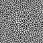
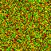

# Bachelorthesis

--------
## About me
--------
 - undergraduate IT student interested in :
    - modern graphics hardware
    - real time applications 
    - path tracing

--------
## Prerequisites
--------

- Falcor 
- VS 2017/19
- DirectXRaytracing (DXR)

--------------------------
## Purpose of this project
--------------------------
Rendering using hardware-assisted ray tracing and associated techniques are currently gaining in importance in real-time computer graphics.
Despite this new hardware support, only a little computing time is given to calculate one
single image. Along with this short computing time, there are fewer ray paths with accordingly fewer
Length. Previous work already has shown how to counteract the resulting image noise,
included the blue noise error distributions and emphasized and clarified their importance in increasing the perceptible image quality.
This work explains a temporally stable algorithm based on this technique. In contrast to the previous approaches, we want to apply an error redistribution directly in the image space, and so one accordingly to get correlated pixel sequence. The algorithm achieves all of this without significant additional computing effort.

- going from the typical noisy output by a path tracer

- to the eye pleasing output of the extra temporal algorithm: a temporally stable blue noise screen space distribution

 
--------------------
## Algorithmic Analysis
--------------------
- Simulated Annealing
- Path Tracing

--------------------
### Installing
--------------------

- Retargeting should run immediately after cloning

- For the Falcor part:
    - Falcor 4.3.1 will be added as submodule
    - copy the content of the assets folder into the \media subfolder of the \TemporalAlgortihm folder
    - copy entire folder \Code into \TemporalAlgorithm
    - now follow the steps descriped in Falcor README.md for adding our temporal Algorithm solution to the framework 

--------------------
## Running the program
--------------------
- Falcor Project

    - Red - Toogle the retarget pass, will only be affective if white noise disabled

    - Green - add temporal reprojection to your retargeting pass 

    - Blue - Toogle to a conventional approach with a white noise 

    - Yellow - toogle to sorting pass, will only be affective if white noise is disabled 

- RetargetingGui

    - Qt Gui support is still under development! Do not use!

- Retargeting

    - Very simplified GUI gives opportunity to start the calculation of a permutation texture
    
        - right now I support basic GUI without choosing parameter for the annealing process by your own
        - each button will start a calculation in a new thread
    - all textures/visualization pics etc will be saved under the \pictures subfolder
    

        
        
    

    
    

--------------------
## Built With
--------------------

* [Falcor](https://developer.nvidia.com/falcor) - The real-time rendering framework used
* [Matplotlib](https://github.com/lava/matplotlib-cpp) - C++ Wrapper Class for the python lib

--------------------
## Authors
--------------------

* **Jonas Heinle** - [Kataglyphis](https://github.com/Kataglyphis)

--------------------
## License
--------------------

This project is licensed under the BSD License - see the [LICENSE.md](LICENSE.md) file for details

--------------------
## Acknowledgments
--------------------

This work was inspired by previous work on blue noise. Especially to mention:
* https://eheitzresearch.wordpress.com/772-2/
* https://dl.acm.org/doi/10.1145/2897839.2927430
